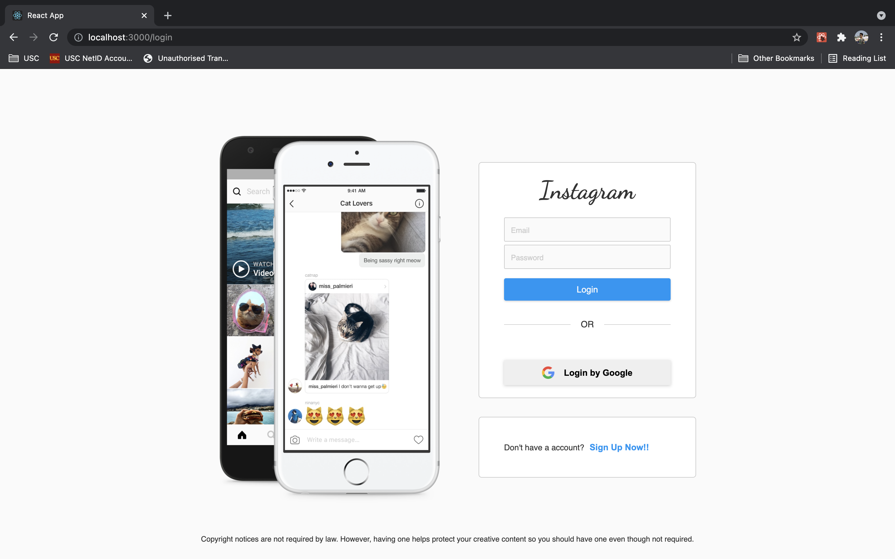

# Instagram Clone

### About

Instagram CLone is a React.js Web Application created for the sole purpose of learning.

#### [View the application live](https://insta-clone-6e4ba.web.app/login)

### Technology Stack

Web Frontend developed using React.js
Backend developed using Node.js/Express
User registration using Google Login and Firebase Authenication
Data stored in Firebase

### Features

#### User -> (Has all basic instagram features)

- Users can post which will be visible to only those user who follows him/her.
- Like, Comment, Share a post.
- Chat, Follow any User.
- UI inspired by Instagram.

## React Screenshots

### Dashboard

